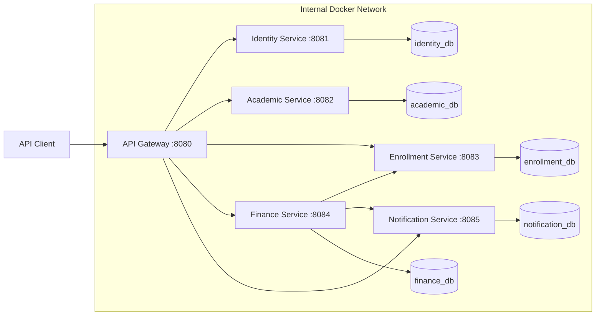

# CenterFlow ERP

CenterFlow ERP is a backend-only educational center management system built with Java 21 and Spring Boot using a microservices architecture.

It manages the core academic, enrollment, finance, attendance, security, reporting, and notification workflows required by educational centers and institutes.

The project emphasizes clear business boundaries, service-owned data, practical security, automated testing, and reproducible local deployment.

## Project Status

The backend MVP is implemented and operational.

The current version includes:

- Six independently structured microservices.
- JWT authentication and role-based authorization.
- Secure first-administrator bootstrap and administrator role assignment.
- Academic, attendance, enrollment, finance, reporting, and notification workflows.
- Pricing plans, installments, payments, refunds, expenses, and instructor earnings.
- Overdue installment processing.
- Cross-service enrollment activation after the required initial payment.
- Separate PostgreSQL databases and database roles for every data-owning service.
- Health, liveness, readiness, and Prometheus endpoints.
- Unit, integration, security, database-backed, runtime, and end-to-end verification.
- Docker Compose deployment with internal services isolated by default.

## Architecture Overview



External requests enter through the API Gateway.

In the default Docker Compose configuration, only the API Gateway is published to the host. PostgreSQL and the five internal services remain reachable only inside the Docker network.

Each data-owning service has its own database, credentials, Flyway migrations, domain rules, and API boundaries. No service reads or writes another service's tables.

## Core Services

| Service | Container Port | Responsibility |
| --- | ---: | --- |
| `api-gateway` | `8080` | Routes external requests, validates JWTs, enforces role-based access, and blocks internal routes |
| `identity-service` | `8081` | Registration, login, users, roles, role assignment, access tokens, refresh tokens, logout, password reset, and administrator bootstrap |
| `academic-service` | `8082` | Branches, classrooms, courses, batches, instructors, schedules, attendance, capacity rules, and academic reports |
| `enrollment-service` | `8083` | Students, enrollment creation, enrollment lifecycle, status changes, filtering, and activation |
| `finance-service` | `8084` | Pricing plans, financial accounts, installments, payments, allocations, refunds, adjustments, expenses, instructor earnings, overdue processing, and financial reports |
| `notification-service` | `8085` | Persistent notifications, filtering, pagination, status management, references, and event-source tracking |

## Technology Stack

- Java 21
- Spring Boot 4.1.0
- Spring Cloud 2025.1.2
- Spring Cloud Gateway
- Spring Security
- OAuth2 Resource Server
- JWT
- PostgreSQL 17
- Spring Data JPA
- Hibernate
- Flyway
- Maven Wrapper
- Docker and Docker Compose
- JUnit 5
- Mockito
- MockMvc
- WebTestClient
- Spring Boot Actuator
- Micrometer
- Prometheus Registry

Kafka, Resilience4j, service discovery, Kubernetes, and distributed transaction frameworks are intentionally excluded from the current MVP because its implemented requirements do not yet justify their operational complexity.

## Architecture Principles

- Each microservice owns its data and database migrations.
- Services never access another service's tables.
- No shared database schema or shared JPA entities are used.
- Cross-service references use identifiers instead of cross-database foreign keys.
- Cross-service communication uses internal REST APIs.
- Process-local Spring application events coordinate after-commit work where required.
- Business rules are enforced by the service that owns the relevant domain data.
- Search, filtering, sorting, and pagination are executed in database queries.
- Financial values use `BigDecimal`.
- REST controllers return DTOs instead of JPA entities.
- Database changes are managed with Flyway.
- Internal endpoints are blocked by the API Gateway and are not published by the default Docker configuration.
- Technologies and patterns are added only when they solve an implemented requirement.

## Implemented Features

### Identity and Security

- User registration and secure password hashing.
- User login and JWT access-token generation.
- Refresh-token rotation, revocation, and logout.
- Role-based authorization at the API Gateway.
- Defense in depth for Identity administrator endpoints.
- Administrator-only role replacement API.
- Protection against an administrator removing their own `ADMIN` role.
- First-administrator bootstrap that is disabled by default.
- Password reset tokens with configurable expiry.
- Public, authenticated, and role-restricted route configuration.
- Blocking external access to internal service endpoints.

The seeded roles are:

```text
ADMIN
BRANCH_MANAGER
ACCOUNTANT
INSTRUCTOR
RECEPTIONIST
STUDENT
```

### Academic Management

- Branch management.
- Classroom management.
- Course management.
- Batch and group management.
- Instructor management.
- Schedule management.
- Batch capacity and seat validation.
- Attendance recording.
- Academic search, filtering, sorting, and pagination.
- Academic overview, batch, and student-attendance reports.

### Enrollment Management

- Student management.
- Enrollment creation with an initial `PENDING_PAYMENT` status.
- Enrollment lifecycle management.
- Batch validation and capacity checks.
- Enrollment activation after the required initial payment is satisfied.
- Enrollment status transitions.
- Database-backed filtering and pagination.

### Finance Management

- Pricing plan management.
- Configurable installment count.
- Configurable initial payment amount.
- Enrollment financial-account creation.
- Installment generation.
- Partial and full payment recording.
- Payment allocation across installments.
- Initial-payment validation.
- Persistent enrollment-activation tasks.
- Refund processing.
- Financial adjustments.
- Expense management.
- Instructor earnings.
- Financial overview and account reports.
- Overdue installment detection and scheduled processing.
- Notification requests after successful financial operations.

### Notifications

- Persistent notification storage.
- Payment-recorded notifications.
- Payment-refunded notifications.
- Overdue-installment notifications.
- Filtering and pagination.
- Reference type and reference ID support.
- Notification status management.
- Event-source tracking.
- Idempotent processing support for repeated business events.

## Enrollment Payment Workflow

The main cross-service workflow is:

```text
1. A pricing plan is created in Finance Service.
2. Enrollment Service creates an enrollment with PENDING_PAYMENT status.
3. Finance Service creates the enrollment financial account.
4. Finance Service generates installments from the selected pricing plan.
5. A payment is recorded and allocated to installments.
6. Finance Service checks whether the required initial payment is satisfied.
7. Finance Service creates an enrollment activation task.
8. After the payment transaction commits, Finance Service calls Enrollment Service through an internal API.
9. Enrollment Service changes the enrollment status to ACTIVE.
10. Finance Service requests a PAYMENT_RECORDED notification.
11. Notification Service stores the notification.
```

The activation task is processed in an independent transaction so its status and attempt information remain consistent during after-commit processing.

## Database Isolation

For local development, one PostgreSQL container hosts separate logical databases and roles:

| Service | Database | Role |
| --- | --- | --- |
| Identity Service | `identity_db` | `identity_app` |
| Academic Service | `academic_db` | `academic_app` |
| Enrollment Service | `enrollment_db` | `enrollment_app` |
| Finance Service | `finance_db` | `finance_app` |
| Notification Service | `notification_db` | `notification_app` |

Each application role owns and connects only to its own service database.

Initialization scripts are located in:

```text
infrastructure/docker/postgres/init
```

## Repository Structure

```text
centerflow-erp/
├── docs/
│   └── architecture.md
├── infrastructure/
│   └── docker/
│       └── postgres/
│           └── init/
├── scripts/
│   ├── verify-academic-reports-runtime.ps1
│   ├── verify-enrollment-payment-e2e.ps1
│   ├── verify-financial-reports-runtime.ps1
│   ├── verify-overdue-installment-notifications-runtime.ps1
│   ├── verify-rbac-runtime.ps1
│   ├── verify-service-isolation.ps1
│   └── wait-for-centerflow-runtime.ps1
├── services/
│   ├── api-gateway/
│   ├── identity-service/
│   ├── academic-service/
│   ├── enrollment-service/
│   ├── finance-service/
│   └── notification-service/
├── .dockerignore
├── .env.example
├── .gitattributes
├── .gitignore
├── compose.dev.yaml
├── compose.yaml
├── Dockerfile
├── mvnw
├── mvnw.cmd
├── pom.xml
└── README.md
```

## Prerequisites

- Java 21
- Docker Desktop or Docker Engine with Docker Compose
- Git
- PowerShell for the supplied runtime verification scripts

The Maven build and Docker Compose deployment work on Windows, Linux, and macOS. The current runtime verification scripts are PowerShell-oriented and have been tested on Windows.

## Environment Configuration

Create a local `.env` file from `.env.example`.

### Windows PowerShell

```powershell
Copy-Item .env.example .env
```

### Linux or macOS

```bash
cp .env.example .env
```

Update the placeholders in `.env` with secure local values.

Important variables include:

```dotenv
POSTGRES_ADMIN_PASSWORD=
IDENTITY_DB_PASSWORD=
ACADEMIC_DB_PASSWORD=
ENROLLMENT_DB_PASSWORD=
FINANCE_DB_PASSWORD=
NOTIFICATION_DB_PASSWORD=
JWT_SECRET=
IDENTITY_ADMIN_BOOTSTRAP_ENABLED=false
IDENTITY_ADMIN_BOOTSTRAP_EMAIL=
IDENTITY_ADMIN_BOOTSTRAP_PASSWORD=
```

The `.env` file contains secrets and must never be committed.

## First Administrator Bootstrap

Administrator bootstrap is disabled by default.

For the first local administrator only:

1. Set `IDENTITY_ADMIN_BOOTSTRAP_ENABLED=true`.
2. Set an unused administrator email.
3. Set a password containing 12 to 64 characters with at least one English letter and one number.
4. Start or recreate Identity Service.
5. Confirm that the administrator can log in.
6. Set `IDENTITY_ADMIN_BOOTSTRAP_ENABLED=false`.
7. Clear `IDENTITY_ADMIN_BOOTSTRAP_PASSWORD`.
8. Recreate Identity Service.

The bootstrap refuses to promote an existing account by email and becomes idempotent after an administrator assignment exists.

## Running with Docker Compose

### Secure default mode

Build and start PostgreSQL and all six services:

```bash
docker compose up --build --detach
```

Check container status:

```bash
docker compose ps
```

The secure default publishes only:

```text
API Gateway: http://localhost:8080
```

PostgreSQL and service ports `8081` through `8085` remain internal to the Docker network.

### Development and runtime-verification mode

Use the development override when direct database or service access is required:

```bash
docker compose -f compose.yaml -f compose.dev.yaml up --build --detach
```

The override publishes:

| Component | Development URL |
| --- | --- |
| API Gateway | `http://localhost:8080` |
| Identity Service | `http://localhost:8081` |
| Academic Service | `http://localhost:8082` |
| Enrollment Service | `http://localhost:8083` |
| Finance Service | `http://localhost:8084` |
| Notification Service | `http://localhost:8085` |
| PostgreSQL | `localhost:5433` |

The development override is intended for local debugging and automated runtime verification, not as the secure default.

### Stop the system

```bash
docker compose down
```

To stop a development-override stack:

```bash
docker compose -f compose.yaml -f compose.dev.yaml down
```

To remove the PostgreSQL volume as well:

```bash
docker compose down --volumes
```

Removing the volume permanently deletes local database data.

## Main API Routes

| Route | Destination |
| --- | --- |
| `/api/v1/auth/**` | Identity Service |
| `/api/v1/academic/**` | Academic Service |
| `/api/v1/enrollments/**` | Enrollment Service |
| `/api/v1/finance/**` | Finance Service |
| `/api/v1/notifications/**` | Notification Service |

Internal routes are not intended for public clients and are denied through the API Gateway:

```text
/api/v1/academic/internal/**
/api/v1/enrollments/internal/**
/api/v1/finance/internal/**
/api/v1/notifications/internal/**
```

## Observability

Every service exposes:

```text
/actuator/health
/actuator/health/liveness
/actuator/health/readiness
/actuator/prometheus
```

Check the API Gateway:

```bash
curl http://localhost:8080/actuator/health
```

Expected response:

```json
{
  "groups": [
    "liveness",
    "readiness"
  ],
  "status": "UP"
}
```

Metrics contain an `application` tag that identifies the source service.

## Building the Project

### Windows

```powershell
.\mvnw.cmd clean verify
```

### Linux or macOS

```bash
./mvnw clean verify
```

The expected reactor modules are:

```text
CenterFlow ERP
API Gateway
Identity Service
Academic Service
Enrollment Service
Finance Service
Notification Service
```

## Running a Single Service

The required environment variables and PostgreSQL databases must already be available.

### Windows example

```powershell
.\mvnw.cmd -pl services/identity-service spring-boot:run
```

### Linux or macOS example

```bash
./mvnw -pl services/identity-service spring-boot:run
```

## Docker Image Build

The root `Dockerfile` is a reusable multi-stage build. Select a service through the `SERVICE` build argument:

```bash
docker build --build-arg SERVICE=finance-service --tag centerflow/finance-service:local .
```

Supported values:

```text
api-gateway
identity-service
academic-service
enrollment-service
finance-service
notification-service
```

The runtime image:

- Uses a Java 21 JRE.
- Runs the packaged Spring Boot application.
- Runs as a non-root user.
- Does not contain Maven or the complete source tree.

## Runtime Verification

The scripts start the development Compose override when direct service or database access is required and wait for the services to become healthy.

### Non-interactive checks

```powershell
& ".\scripts\verify-academic-reports-runtime.ps1"
& ".\scripts\verify-financial-reports-runtime.ps1"
& ".\scripts\verify-overdue-installment-notifications-runtime.ps1"
& ".\scripts\verify-enrollment-payment-e2e.ps1"
```

### Interactive RBAC check

```powershell
& ".\scripts\verify-rbac-runtime.ps1"
```

This requires valid credentials for an existing administrator.

### Service-isolation check

```powershell
& ".\scripts\verify-service-isolation.ps1"
```

This check recreates the secure default stack and verifies that only the API Gateway is published to the host.

## Testing Strategy

The project includes:

- Unit tests for business rules.
- Repository tests.
- Controller integration tests.
- Security and authorization tests.
- Database-backed integration tests.
- Scheduler tests.
- Cross-service workflow tests.
- Runtime report verification.
- RBAC runtime verification.
- Docker service-isolation verification.
- End-to-end enrollment-payment verification.

The test profile uses H2 where appropriate and disables scheduled production jobs during automated tests.

## Documentation

Architecture decisions, service boundaries, communication rules, security boundaries, and data ownership are documented in:

```text
docs/architecture.md
```

## Development Approach

The project was implemented incrementally with small and focused commits. Each major step included an objective, implementation, automated tests, runtime verification where applicable, and a focused Git commit.

## Current Completion Status

- [x] Define MVP scope, service boundaries, and data ownership.
- [x] Create the Maven multi-module structure and six services.
- [x] Configure isolated PostgreSQL databases and roles.
- [x] Implement authentication, JWT security, RBAC, and administrator bootstrap.
- [x] Implement academic, enrollment, finance, notification, attendance, and reporting workflows.
- [x] Implement overdue installment processing.
- [x] Implement cross-service enrollment activation.
- [x] Add health, liveness, readiness, and Prometheus endpoints.
- [x] Add automated and runtime verification.
- [x] Dockerize all services.
- [x] Isolate internal Docker services by default.
