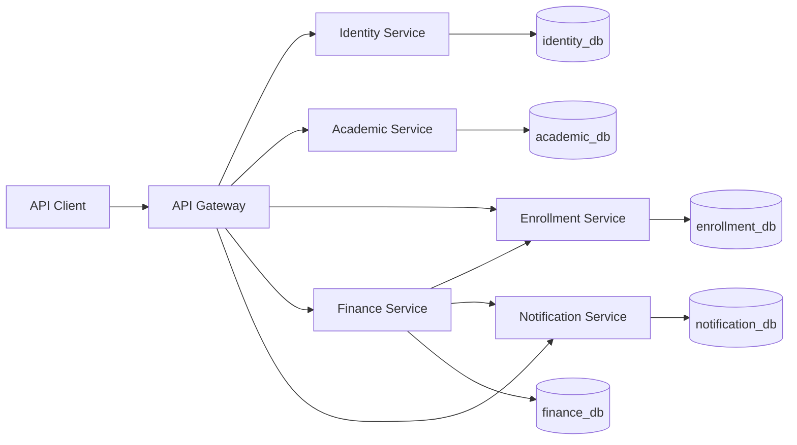

# CenterFlow ERP

CenterFlow ERP is a backend-only educational center management system built with Java and Spring Boot using a microservices architecture.

The system manages the main academic, enrollment, financial, attendance, and notification workflows required by educational centers and institutes.

The project focuses on clear business boundaries, isolated service data, maintainable code, automated testing, and production-oriented operational practices.

## Project Status

The backend MVP is implemented and operational.

The current version includes:

- Six independently structured microservices.
- Authentication and JWT-based authorization.
- Academic and attendance management.
- Student enrollment workflows.
- Pricing plans, installments, payments, refunds, and expenses.
- Instructor earnings and financial reports.
- Overdue installment processing.
- Internal communication between services.
- Persistent notifications generated from financial events.
- Health probes and Prometheus metrics.
- Automated tests and an end-to-end verification scenario.
- Full local deployment using Docker Compose.

## Architecture Overview



External requests enter through the API Gateway.

Each service owns its data and business rules. Services communicate through REST APIs and application events without accessing another service's database directly.

## Core Services

| Service | Port | Responsibility |
| --- | ---: | --- |
| `api-gateway` | `8080` | Routes external requests, protects APIs, validates JWT access tokens, and blocks internal endpoints |
| `identity-service` | `8081` | Registration, authentication, users, roles, access tokens, refresh tokens, logout, and password reset |
| `academic-service` | `8082` | Branches, classrooms, courses, batches, instructors, schedules, attendance, and academic reports |
| `enrollment-service` | `8083` | Students, enrollment lifecycle, batch capacity, enrollment status changes, and activation |
| `finance-service` | `8084` | Pricing plans, financial accounts, installments, payments, allocations, refunds, expenses, instructor earnings, and financial reports |
| `notification-service` | `8085` | Stores, filters, paginates, and manages notifications generated by business events |

## Technology Stack

- Java 21
- Spring Boot 4.1.0
- Spring Cloud 2025.1.2
- Spring Cloud Gateway
- Spring Security
- OAuth2 Resource Server
- JWT authentication
- PostgreSQL 17
- Spring Data JPA
- Hibernate
- Flyway
- Maven Wrapper
- Docker
- Docker Compose
- JUnit 5
- Mockito
- MockMvc
- WebTestClient
- Spring Boot Actuator
- Micrometer
- Prometheus Registry

Technologies such as Kafka and Resilience4j are intentionally not included yet because the current requirements do not justify their additional operational complexity.

## Architecture Principles

- Each microservice owns its database.
- Services do not access another service's tables.
- No shared database schema is used.
- No JPA entities are shared between services.
- Services communicate using IDs, DTOs, internal APIs, and application events.
- Business rules are enforced by the service that owns the relevant data.
- Search, filtering, sorting, and pagination are executed in database queries.
- Financial values use `BigDecimal`.
- REST controllers return response DTOs instead of JPA entities.
- Database schema changes are managed with Flyway.
- Internal endpoints are blocked from public access through the API Gateway.
- Important after-commit workflows run inside independent transactions when required.
- Technologies and patterns are introduced only when they solve a clear business or technical problem.

## Implemented Features

### Identity and Security

- User registration.
- Secure password hashing.
- User authentication.
- JWT access token generation.
- Refresh token workflow.
- Token revocation and logout.
- Role-based authorization.
- Password reset tokens with configurable expiry.
- API Gateway JWT validation.
- Public and protected route configuration.
- Blocking internal service endpoints from external clients.

### Academic Management

- Branch management.
- Classroom management.
- Course management.
- Batch and group management.
- Instructor management.
- Schedule management.
- Attendance recording.
- Academic search and filtering.
- Academic reports.

### Enrollment Management

- Student management.
- Enrollment creation.
- Enrollment lifecycle management.
- Initial `PENDING_PAYMENT` enrollment status.
- Batch capacity validation.
- Enrollment activation after satisfying the initial payment.
- Enrollment status transitions.
- Database-backed filtering and pagination.

### Finance Management

- Pricing plan management.
- Configurable installment count.
- Configurable initial payment amount.
- Enrollment financial account creation.
- Installment generation.
- Partial and full payment recording.
- Payment allocation across installments.
- Initial payment validation.
- Automatic enrollment activation request.
- Refund processing.
- Financial adjustments.
- Expense management.
- Instructor earnings.
- Financial reports.
- Overdue installment detection.
- Scheduled overdue installment processing.
- Notification events after successful financial transactions.

### Notifications

- Persistent notification storage.
- Payment recorded notifications.
- Payment refunded notifications.
- Overdue installment notifications.
- Notification filtering.
- Pagination.
- Reference type and reference ID support.
- Notification status management.
- Event source tracking.

## Enrollment Payment Workflow

The main cross-service workflow is:

```text
1. A pricing plan is created in Finance Service.
2. An enrollment is created with PENDING_PAYMENT status.
3. Finance Service creates an enrollment financial account.
4. Installments are generated from the selected pricing plan.
5. A payment is recorded and allocated to installments.
6. Finance Service checks whether the initial payment is satisfied.
7. An enrollment activation task is created.
8. Finance Service calls Enrollment Service through an internal API.
9. Enrollment Service changes the enrollment status to ACTIVE.
10. Finance Service publishes a payment notification event.
11. Notification Service stores a PAYMENT_RECORDED notification.
```

The activation workflow is executed after the payment transaction commits.

Enrollment activation processing uses a separate `REQUIRES_NEW` transaction so that activation task status and attempt information are committed correctly during after-commit event handling.

## Database Isolation

For local development, the services use one PostgreSQL container with separate databases and database roles:

| Service | Database | Role |
| --- | --- | --- |
| Identity Service | `identity_db` | `identity_app` |
| Academic Service | `academic_db` | `academic_app` |
| Enrollment Service | `enrollment_db` | `enrollment_app` |
| Finance Service | `finance_db` | `finance_app` |
| Notification Service | `notification_db` | `notification_app` |

Each application role owns and connects only to its service database.

The database initialization scripts are located in:

```text
infrastructure/docker/postgres/init
```

## Repository Structure

```text
centerflow-erp/
├── docs/
│   └── architecture.md
├── infrastructure/
│   └── docker/
│       └── postgres/
│           └── init/
├── scripts/
│   └── verify-enrollment-payment-e2e.ps1
├── services/
│   ├── api-gateway/
│   ├── identity-service/
│   ├── academic-service/
│   ├── enrollment-service/
│   ├── finance-service/
│   └── notification-service/
├── .dockerignore
├── .env.example
├── compose.yaml
├── Dockerfile
├── pom.xml
└── README.md
```

## Environment Configuration

Create a local `.env` file from `.env.example`.

### Windows PowerShell

```powershell
Copy-Item .env.example .env
```

Update the placeholders in `.env` with secure local values.

Important variables include:

```dotenv
POSTGRES_ADMIN_PASSWORD=
IDENTITY_DB_PASSWORD=
ACADEMIC_DB_PASSWORD=
ENROLLMENT_DB_PASSWORD=
FINANCE_DB_PASSWORD=
NOTIFICATION_DB_PASSWORD=
JWT_SECRET=
```

The `.env` file contains secrets and must not be committed to source control.

## Running with Docker Compose

Make sure Docker Desktop is running.

Build and start PostgreSQL and all six services:

```powershell
docker compose up --build --detach
```

Check container status:

```powershell
docker compose ps
```

The expected containers are:

```text
centerflow-postgres
centerflow-api-gateway
centerflow-identity-service
centerflow-academic-service
centerflow-enrollment-service
centerflow-finance-service
centerflow-notification-service
```

Stop the system:

```powershell
docker compose down
```

Stop the system and remove the PostgreSQL volume:

```powershell
docker compose down --volumes
```

Removing the volume permanently deletes the local database data.

## Local Service URLs

| Component | URL |
| --- | --- |
| API Gateway | `http://localhost:8080` |
| Identity Service | `http://localhost:8081` |
| Academic Service | `http://localhost:8082` |
| Enrollment Service | `http://localhost:8083` |
| Finance Service | `http://localhost:8084` |
| Notification Service | `http://localhost:8085` |
| PostgreSQL | `localhost:5433` |

The individual service ports are exposed for local development and testing.

External application traffic should normally go through the API Gateway.

## Main API Routes

| Route | Destination |
| --- | --- |
| `/api/v1/auth/**` | Identity Service |
| `/api/v1/academic/**` | Academic Service |
| `/api/v1/enrollments/**` | Enrollment Service |
| `/api/v1/finance/**` | Finance Service |
| `/api/v1/notifications/**` | Notification Service |

Internal routes are not intended for public clients.

Examples include:

```text
/api/v1/academic/internal/**
/api/v1/enrollments/internal/**
/api/v1/finance/internal/**
/api/v1/notifications/internal/**
```

## Observability

Every service exposes Spring Boot Actuator endpoints.

### Health

```text
/actuator/health
```

### Liveness

```text
/actuator/health/liveness
```

### Readiness

```text
/actuator/health/readiness
```

### Prometheus Metrics

```text
/actuator/prometheus
```

Example:

```powershell
curl.exe http://localhost:8080/actuator/health
```

Expected response:

```json
{
  "groups": [
    "liveness",
    "readiness"
  ],
  "status": "UP"
}
```

Metrics contain an `application` tag that identifies the service:

```text
application="api-gateway"
application="identity-service"
application="academic-service"
application="enrollment-service"
application="finance-service"
application="notification-service"
```

## Building the Project

Run the full Maven build using the included wrapper:

```powershell
.\mvnw.cmd clean verify
```

The expected reactor modules are:

```text
CenterFlow ERP
API Gateway
Identity Service
Academic Service
Enrollment Service
Finance Service
Notification Service
```

## Running a Single Service

Example for Identity Service:

```powershell
.\mvnw.cmd `
    -pl services/identity-service `
    spring-boot:run
```

Example for Finance Service:

```powershell
.\mvnw.cmd `
    -pl services/finance-service `
    spring-boot:run
```

The required environment variables and PostgreSQL databases must be available before starting a service directly.

## Docker Image Build

The root `Dockerfile` is a reusable multi-stage Dockerfile.

The required service is selected using the `SERVICE` build argument.

Example:

```powershell
docker build `
    --build-arg SERVICE=finance-service `
    --tag centerflow/finance-service:local `
    .
```

Supported values are:

```text
api-gateway
identity-service
academic-service
enrollment-service
finance-service
notification-service
```

The final runtime image:

- Uses Java 21 JRE.
- Runs the packaged Spring Boot application.
- Does not run as the root user.
- Does not contain Maven or the complete source code.

## End-to-End Verification

The repository contains a PowerShell end-to-end verification script:

```text
scripts/verify-enrollment-payment-e2e.ps1
```

Run it while Enrollment, Finance, Notification, and PostgreSQL are available:

```powershell
& ".\scripts\verify-enrollment-payment-e2e.ps1"
```

The scenario verifies:

- Pricing plan creation.
- Enrollment creation with `PENDING_PAYMENT`.
- Financial account creation.
- Installment generation.
- Initial payment recording.
- Payment allocation.
- Enrollment activation task processing.
- Enrollment transition to `ACTIVE`.
- Payment notification creation.
- Database consistency across service-owned databases.
- Test fixture cleanup.

Expected final result:

```text
Enrollment Payment End-to-End scenario passed.
End-to-End runtime fixtures removed.
```

## Testing Strategy

The project includes:

- Unit tests for business rules.
- Repository tests.
- Controller integration tests.
- Security tests.
- Database-backed integration tests.
- Scheduler tests.
- Service integration tests.
- Cross-service notification tests.
- End-to-end runtime verification.

The test profile uses H2 where appropriate and disables scheduled production jobs during automated tests.

## Documentation

Architecture decisions, service boundaries, communication rules, and data ownership are documented in:

```text
docs/architecture.md
```

## Development Approach

The project was implemented incrementally using small and focused commits.

Each implementation step included:

1. A clear business or technical objective.
2. An explanation of why the feature was required.
3. Complete implementation files.
4. Automated tests for important rules.
5. Local runtime verification.
6. A focused Git commit.

## Current Completion Status

- [x] Define MVP scope.
- [x] Define service boundaries.
- [x] Define data ownership.
- [x] Create Maven multi-module structure.
- [x] Create the six microservices.
- [x] Configure isolated PostgreSQL databases and roles.
- [x] Implement authentication and JWT security.
- [x] Implement academic management.
- [x] Implement enrollment management.
- [x] Implement finance management.
- [x] Implement notification management.
- [x] Implement attendance workflows.
- [x] Implement academic reports.
- [x] Implement financial reports.
- [x] Implement overdue installment automation.
- [x] Implement cross-service enrollment activation.
- [x] Implement end-to-end verification.
- [x] Add health, liveness, and readiness probes.
- [x] Add Prometheus metrics.
- [x] Dockerize all microservices.
- [x] Run the complete system using Docker Compose.
